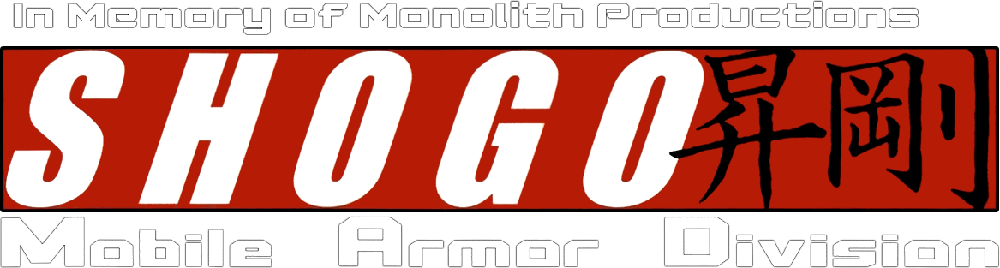
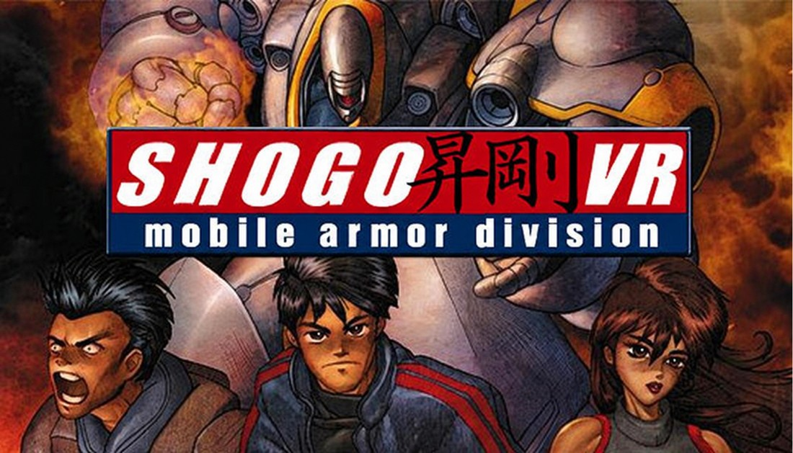
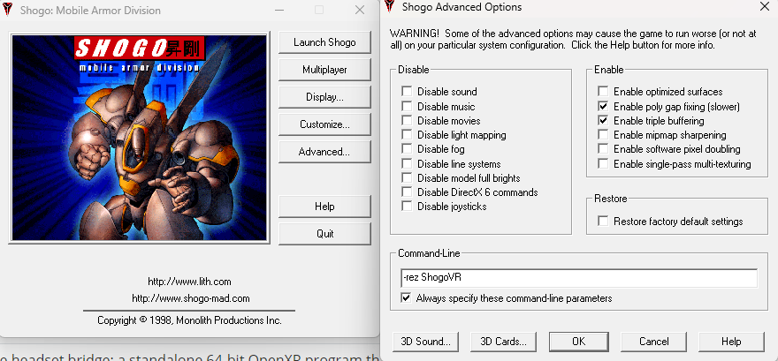

# Shogo VR

**Play Shogo: Mobile Armor Division (1998) in a PC VR headset.**

**Shogo VR** is an **unofficial VR mod**, unaffiliated with Monolith Productions or any of its affiliates and subsidiaries. 

**It's free**, and you need your own copy of the game.

> **THIS MOD IS NOT MADE BY OR SUPPORTED BY Monolith Productions, or any of its affiliates and subsidiaries.**

**Created by:** *[Brandon Withington] — [brandon.f.withington@gmail.com]*

## Features

- **True stereo 3D** with 6DoF head tracking, and a world scale calibrated for on foot and in a mech.
- **Motion controllers:** aim with your hand, two-handed aiming, snap or smooth turning, left-handed mode, transforming your mech, and easier ladders. Supports Meta Quest/Rift, Valve Index, HTC Vive and Windows Mixed Reality.
- **A sharp HUD** on its own floating panel, with menus, cutscenes and loading screens on a floating screen.
- **Your body** when you look down, Sanjuro or your mech, animated as you move.
- **Picture quality:** frames go straight from the game's renderer to the headset, so your monitor doesn't limit them. On top of that come sharpening, upscaling and an optional comfort vignette.
- **A left-eye window** on the desktop, for recording and streaming.
- **A launcher with all the VR settings**, also available in-game under *Options → vr settings*. Changes apply while you play.

## Requirements

- Your own copy of **Shogo: Mobile Armor Division v2.2** ([Steam](https://store.steampowered.com/) or [GOG](https://www.gog.com/)).
- A PC VR headset with SteamVR, and SteamVR set as the OpenXR runtime (*SteamVR → Settings → OpenXR → Set SteamVR as OpenXR Runtime*).
- Shogo running in a window. With dgVoodoo 2, set *Appearance* to *Windowed*; the mod takes care of the window's size.

## Install and play

1. Download **ShogoVR-Setup.exe** from [Releases](../../releases) and run it. It finds Shogo, installs the mod into its own `ShogoVR` folder (your game files aren't changed) and adds the shortcuts.
2. Start **Shogo VR** from your Desktop or Start menu and press **Play**.
3. In the headset, look straight ahead and click the left thumbstick to recenter yourself in your 3d space.

If the ShogoVR launcher is unable to launch Shogo which unfortunately is quite common, you can also start Shogo your usual way (`Shogo.exe`, Steam) with `-rez ShogoVR` on its command line; the headset bridge starts by itself. If you know where your Shogo.exe install is, launch that and go into the advanced options and type this into the command line prompt `-rez ShogoVR`

To uninstall, use *Windows Settings → Apps → Installed apps → Shogo VR*.

The installer and launcher aren't code-signed. If Windows shows "Windows protected your PC", choose *More info → Run anyway*.

## Controls (Touch layout; others are similar)

| Action | Button | Action | Button |
|---|---|---|---|
| Aim | right hand | Fire | right trigger |
| Move | left stick | Turn / change weapon | right stick |
| Jump | A | Crouch | B (hold) |
| Transform (mech) | tap B | Next weapon | right grip |
| Menu | left menu button | Mission log | X |
| Weapon list | Y or left grip | Recentre | left stick click |

- **Left-handed mode** mirrors all of this.
- **Two-handed aiming:** hold your other hand in front of the gun, along the barrel.
- **Ladders:** stick forward climbs up, back climbs down.
- **Transforming** presses the key bound to *Vehicle mode toggle* (*Options → Keyboard*), so that action needs a key.
- **Remapping:** buttons can be changed in SteamVR's controller binding settings.

## Best picture

- **Resolution:** pick a high resolution in Shogo, such as 3840×2160. With NVIDIA DSR or AMD VSR enabled, those resolutions appear even on a 1080p desktop. The Shogo window may then be larger than your screen; that's expected.
- **Video memory:** the mod sets dgVoodoo's emulated video memory to 2 GB, because its 256 MB default makes textures blurrier the longer you play. Your original `dgVoodoo.conf` is kept as `dgVoodoo.conf.shogovr-backup`.
- **Hotkeys:** Ctrl+Shift+S (sharpening), Ctrl+Shift+U (upscaling), Ctrl+Shift+M (left-eye window), Ctrl+Shift+R (recentre), Ctrl+Shift+F (fix the game window).

## Troubleshooting

Your new`ShogoVR` folder holds three logs, each rewritten every run. Please attach them to bug reports:

- `ShogoVR_launch.log`: what the launcher did.
- `ShogoVRBridge.log`: window, focus, capture and settings.
- `ShogoVR_game.log`: player mode, camera FOV, zoom, resolution and renderer events.

**If the launcher can't start the game on your PC, or if it crashes before you see anything in your VR headset**, start Shogo once from `Shogo.exe` with `-rez ShogoVR` in the advanced options in the command line like the following : 

 The mod remembers that working command line, and the launcher uses it from then on.

## Known Issues

* Often the launcher after installation and upon first launch will not be able to launch ShogoVR properly.
* The game can and will crash at random.
* VR body simulation is a bit wonky

## What's in this repository

| Folder | Contents |
|---|---|
| `bridge/` | The headset bridge: a standalone 64-bit OpenXR program that shows the game in the headset and reads the controllers. |
| `launcher/` | The launcher, settings window and installer (Win32, no dependencies), with their artwork and icon. |
| `game/` | The mod's own game-side source files (stereo rendering, VR menu, direct capture). |
| `tools/leakcheck.py` | Checks that nothing from Monolith's source has slipped into this repository. |

**Not included:** Monolith's Shogo source code. The VR game code (`CShell.dll`) is built from Monolith's Shogo v2.2 source release. Its licence lets mods be shared free of charge but forbids redistributing the source, so `CShell.dll` ships only in compiled form, inside the installer. For the same reason, the edits that connect `game/` into Monolith's own files aren't published here.

Building: `bridge/` and `launcher/` build with Visual Studio or MinGW-w64; see `launcher/BUILD.txt`. The installer is made by `ShogoVR-InstallerBuilder.exe` from a compiled `CShell.dll` plus an `AUTHORS.txt`.

## Legal

- **Unofficial and free.** This mod is not made by or supported by Monolith Productions or any of its affiliates and subsidiaries. It may not be sold or used commercially in any way.
- **Your own copy required.** It works only with a full copy of Shogo, no game files are included, and no game executable is modified.
- **Monolith's rights.** As the Shogo source licence requires, distributing this mod grants Monolith Productions an irrevocable, royalty-free right to use and distribute it.
- **Artwork.** Shogo: Mobile Armor Division, its logo and artwork belong to their respective owners. They're used only to identify the game this mod is for.
- **This repository's own code:** MIT licence, see [LICENSE](LICENSE).
- **Third-party code:** see [NOTICE.md](NOTICE.md). It covers the Khronos OpenXR headers (Apache 2.0) and the AMD FidelityFX CAS-based sharpening (MIT). dgVoodoo 2 is not included.

## In memory of Monolith Productions

Shogo was made by Monolith Productions in 1998, and in 1999 they released its source code so players could keep building on it. This mod exists because of that generosity. Thank you.
